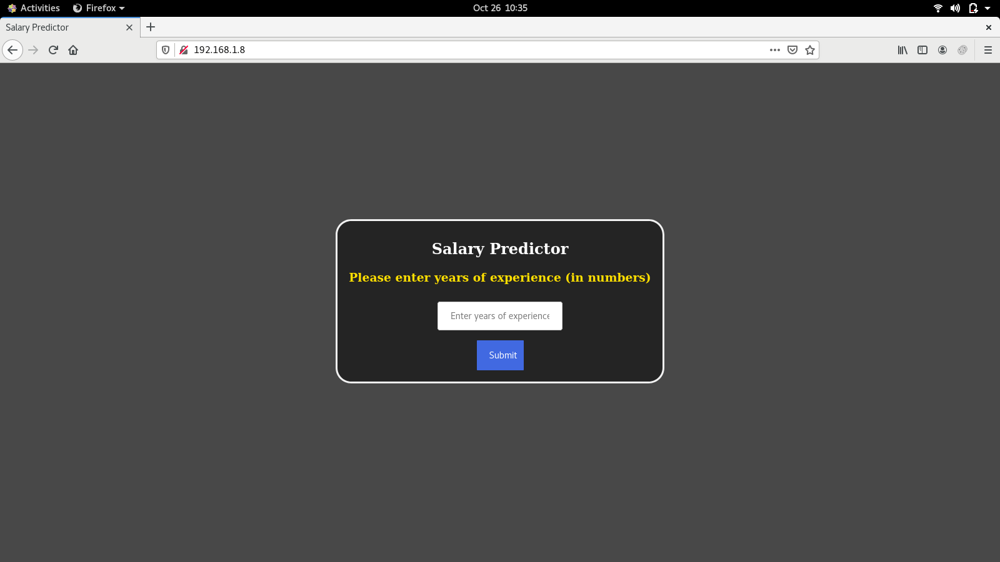
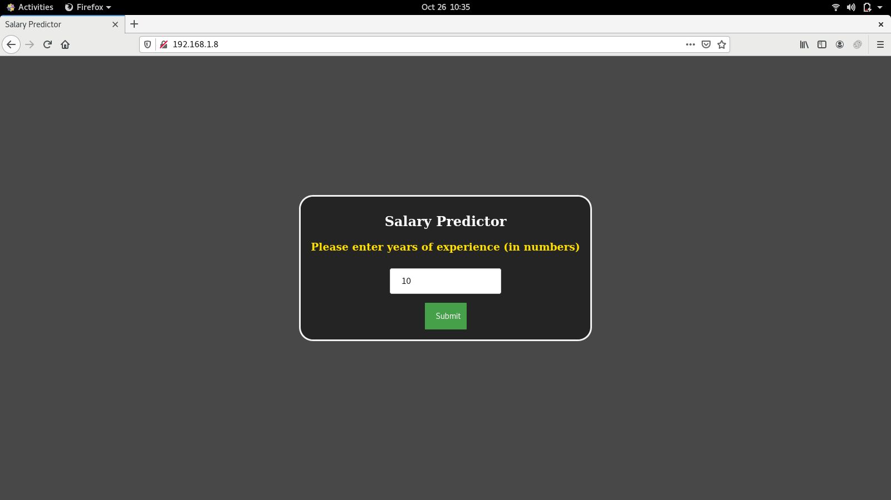
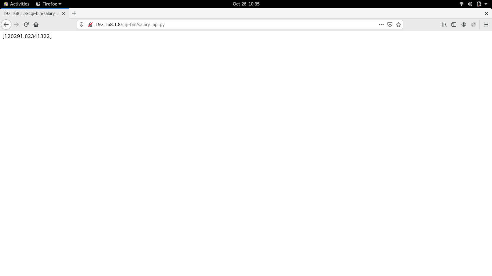

# salary_prediction
This model is trained on very less data.\
The main intention of creating this project was to learn how we can use python code to access model predictions and how to integrate ML model with front-end using python.\
The salary_api.py and salaryModel.pkl should be inside cgi-bin directory.
Following are the some screenshots:-
# Front Page

# Input

# Output

